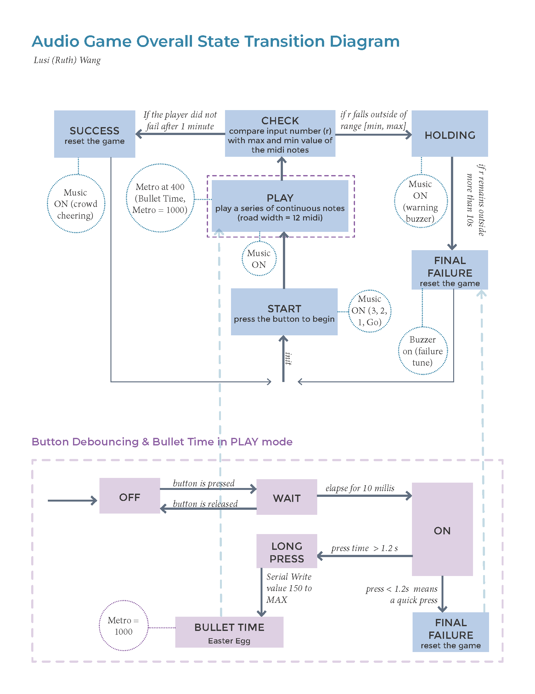
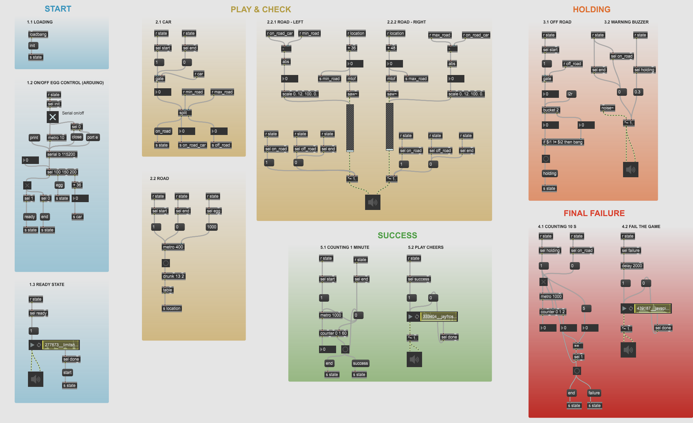

# Audio Racing Game

by Lusi Wang
---

## Project Description

This is an audio racing game prototyped with Arduino Uno and Max MSP
Input: rotary encoder from Arduino
Output: audio in the left and right channel through MAX MSP

## How to run
1. load racing_combined.ino on Arduino
2. open the racing.maxpat in MAX 8 (Appendix B)

## How to use

1. Connect a rotary encoder to an Arduino board (see Appendix C)
2. Choose the serial port in MAX based on the Arduino connection
3. Connect a set of earphones to the computer
4. Click the "serial on/off" button in MAX (see Appendix B) to start/restart the game

## Appendix
### A. State Transition Diagram

### B. Max Patch

### C. Hardware Connection

